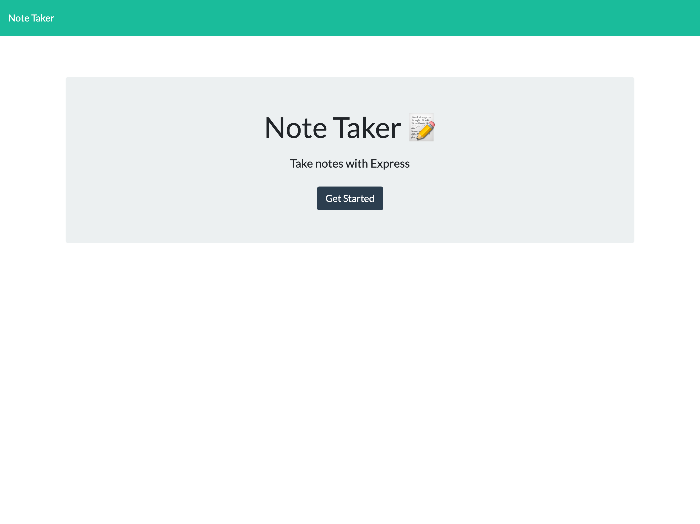
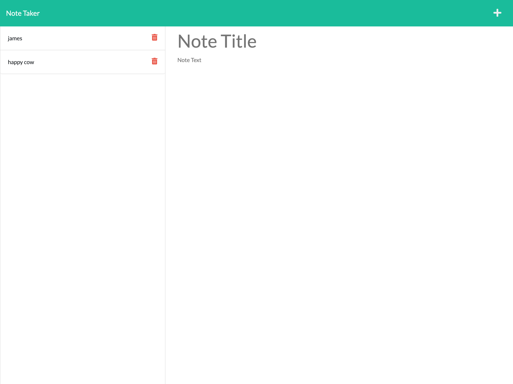

# Express Note Taking App

### Description
This app uses express to make api calls to get/post/delete notes from a db.json file. The focus of this app was to link a frontend to a mock database using express.

[Live Site](https://friendly-guide.herokuapp.com/)
### Installation
install dependancies

    npm install 

run app

    node index  

### Contributions
[Issues and Pull requests can be made to this repo](https://github.com/SuedePritch/friendly-guide)

### Technology
* NodeJS
* Express
* mock database

  

  

